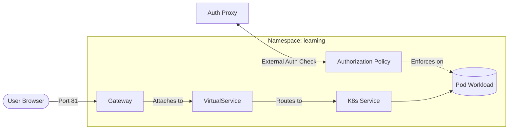

# Learning Lab: Kubernetes Ingress & Backend SSO Pattern

This project documents the evolution from a basic Nginx Ingress setup to an enterprise-grade **Istio Service Mesh** with **Single Sign-On (SSO)**.

## 1. Architecture Overview

### Lab A: Basic Nginx Ingress
- **Ingress Controller**: Nginx (`ingress-nginx`).
- **Routing**: Path-based (`/api/*` vs `/*`).
- **Security**: None (Public access).
- **Port**: 82 (Avoids conflict with port 80/81).

### Lab B: Advanced Istio SSO
- **Service Mesh**: Istio (`istiod`).
- **Ingress**: Istio Ingress Gateway.
- **SSO Pattern**: Backend Pattern SSO (OIDC).
- **IDP**: Keycloak (representing Microsoft Azure AD in enterprise).
- **Auth Proxy**: `oauth2-proxy`.
- **Port**: 81 (Coexists with Nginx).

## 2. The Backend SSO Pattern
Instead of implementing OIDC logic (tokens, redirects, validation) inside the FastAPI application, we use the **Sidecar/Proxy Pattern**:

### Component Nesting Visualization
This diagram shows how the components are physically and logically nested within the cluster:

```mermaid
%%{init: {'flowchart': {'curve': 'stepBefore'}}}%%
flowchart TD
    subgraph Service ["Service (Stable IP/DNS)"]
        direction TB
        
        subgraph Deployment ["Deployment (Manager / ReplicaSet)"]
            direction TB
            
            subgraph Pod ["Pod (Runtime Boundary)"]
                direction LR
                
                subgraph AppContainer ["App Container"]
                    Code[Main Application]
                end
                
                subgraph Sidecar ["Istio Sidecar (Envoy)"]
                    Proxy[Proxy Logic]
                end
            end
        end
    end

    %% Routing Flow
    Internet((Internet)) --> Service
    Service -.->|Label Selector| Pod
    Proxy <-->|Intercepts| Code
```

### Istio Configuration Flow
While the diagram above shows physical nesting, this diagram shows how **Istio Namespace Objects** control the logical flow of traffic and security:



1.  **Gateway**: Defines the "Where" (e.g., port 81, localhost). It opens the hole in the mesh for external traffic.
2.  **VirtualService**: Defines the "How" (the routing logic). It maps paths like `/api` or `/auth` to specific internal Kubernetes services.
3.  **AuthorizationPolicy**: Defines the "Who" (security). In this project, it tells the Gateway to stop every request and ask `oauth2-proxy` if the user is allowed in.

## 3. Key Technical Lessons

### Ingress & Local DNS
- **Istio Gateway Validation**: The Istio Gateway resource requires an FQDN or a wildcard `*`. It rejects "short names" like `localhost`. However, the **VirtualService** can use `localhost` to filter traffic once it passes the gateway.
- **Port Preservation**: When running on non-standard ports (like 81), Keycloak redirects often drop the port. Setting `KC_HOSTNAME_URL` and `KC_HOSTNAME_PORT` explicitly fixes this.

### OIDC & User Requirements
- **Email Verification**: Many OIDC proxies (like `oauth2-proxy`) require a verified email claim by default. Keycloak's default `admin` user has no email, causing 500 errors unless updated or the `--insecure-oidc-allow-unverified-email` flag is used.
- **Cookie Security**: For local `http://localhost` testing, ensure `--cookie-secure=false` is set, otherwise browsers will block the session cookie.

### Automation Best Practices
- **REST API for Config**: Instead of manual UI setup, use the IDP's REST API (Keycloak Admin API) to create clients and fetch secrets during the setup script.
- **Secret Management**: Move sensitive data (Client Secrets, Admin Passwords) from YAML manifests to a `.env` file and use Kubernetes `Secrets` injected via `envFrom` or `secretKeyRef`.
- **Tooling**: `jq` and `yq` are essential for manipulating JSON/YAML in shell scripts, but ensure scripts handle YAML-in-YAML strings (like Istio's ConfigMap) correctly.

## 4. Environment Checklist
- **Context**: `kubectl config use-context colima`
- **Port 81**: Istio Ingress Gateway (SSO App)
- **Port 82**: Nginx Ingress (Simple App)
- **Domain**: `localhost` (No `/etc/hosts` required)
