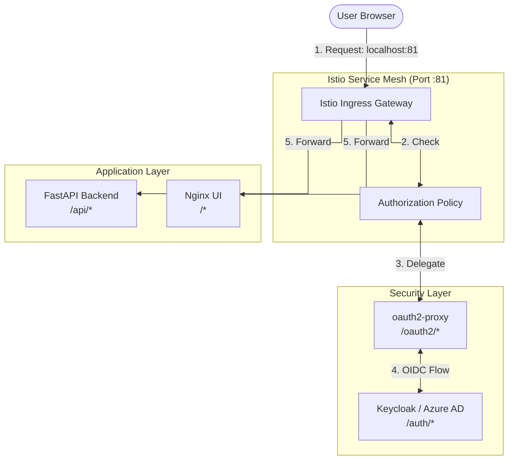

# Istio & SSO (Keycloak) Implementation

This setup replaces Nginx Ingress with **Istio Service Mesh** and implements **Backend Pattern SSO** using **Keycloak** (as an open-source alternative to Azure AD) and **oauth2-proxy**.

## Architecture Overview



1.  **Istio Gateway**: Replaces Nginx. Acts as the entry point for `localhost:81`.
2.  **External Authorization**: Istio is configured to delegate authentication to `oauth2-proxy`.
3.  **oauth2-proxy**: Handles the OIDC flow with Keycloak.
4.  **Keycloak**: The OIDC Identity Provider (SSO).
5.  **FastAPI Backend**: Receives authenticated user information via HTTP headers (e.g., `X-Auth-Request-User`).

## Setup Instructions

### 1. Requirements
Ensure you have `kubectl`, `istioctl`, `jq`, and `yq` installed.

### 2. Run Automated Setup
Run the setup script from this directory:

```bash
./up.sh
```

The script will automatically:
1.  **Install Istio**: Configures the mesh on port 81.
2.  **Configure Mesh**: Registers `oauth2-proxy` as an extension provider in the Istio ConfigMap.
3.  **Setup Environment**: Creates a `.env` file from `.env.template`.
4.  **Configure Keycloak**:
    - Creates the `oauth2-proxy` client.
    - Sets redirect URIs.
    - Fetches the client secret and updates `.env`.
    - Verifies the `admin` user email to allow login.
5.  **Deploy App**: Applies all Kubernetes manifests.

### 3. Access the Application
Once the script finishes, visit **[http://localhost:81](http://localhost:81)** to sign in.

## Backend SSO Pattern in Python
The FastAPI backend (`api/src/main.py`) no longer needs to handle complex OIDC logic. It simply reads the headers provided by the proxy:

```python
@app.get("/api/users")
def get_users(x_auth_request_user: Optional[str] = Header(None)):
    # The proxy handles auth; we just use the user ID from the header
    return {"user": x_auth_request_user, "data": [...]}
```

## Cleanup
To remove the application resources:
```bash
./down.sh
```
